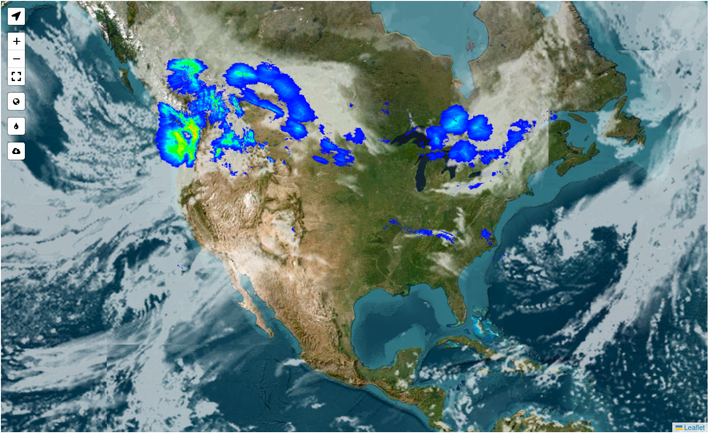

# Dash-Frontend


[](https://github.com/ambv/black)


[](https://community.plotly.com/t/django-dash-token-authentication/82088)



`Dash-Leaflet-Tile-Weather-Explorer` is a leaflet template aimed at showcasing 20 different map tiles, 3 different times to show precipitation in the USA, and a current cloud gage with a location request and full screen mode. This project provides a boilerplate for a solid map focused application, and practical examples designed to streamline the creation and integration of Dash with a leaflet map.


## Features

- **20 Map Styles:** More styles could be added or the ones provided could be replaced refer to: 
- **Rain Radar:** Ready-to-use templates that can be easily integrated into your Dash projects.
- **Cloud Radar:** A variety of examples showcasing different Dash frontend components and their use cases.
- **User Location Detector:** A variety of examples showcasing different Dash frontend components and their use cases.
- **Full Screen Mode:** A variety of examples showcasing different Dash frontend components and their use cases.


API Keys are required for the clouds and some map tiles:
- **jawg-matrix-access-token:** https://www.jawg.io/
- **thunderforest-api-key:** https://www.thunderforest.com/
- **openweathermap-appid:** https://openweathermap.org/


## Getting Started

To get started with `Dash-Leaflet-Tile-Weather-Explorer`, clone this repository to your local machine:

```bash
git clone https://github.com/pip-install-python/Dash-Leaflet-Tile-Weather-Explorer.git
cd dash-frontend
```
Ensure you have the following installed:

- Python (3.6 or later)
- pip
- Virtual environment (recommended)
- Create a config.json file in pages with the API Keys `jawg-matrix-access-token`, `thunderforest-api-key`, and `openweathermap-appid`

### Installation
1. Create and activate a virtual environment:

Windows:
```
python -m venv venv
.\venv\Scripts\activate
macOS/Linux:
```

macOS/Linux
```
python3 -m venv venv
source venv/bin/activate
```

2. Install the required packages:

```
pip install -r requirements.txt
```

### Running Examples
Navigate to the example you wish to run and execute the application:

```
cd weather_map
python app.py
```

### Contributing
Contributions are what make the open-source community such an amazing place to learn, inspire, and create. Showcase your work and help others learn by contributing to: https://community.plotly.com/

### License
Open Source

### Contact
Pip Install Python

Project Link: https://github.com/pip-install-python/Dash-Leaflet-Tile-Weather-Explorer


